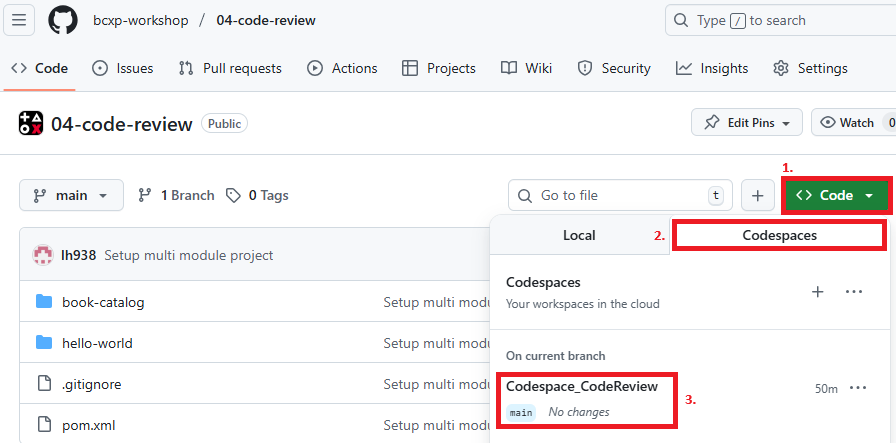

# Modul book-catalog – Workshop-Projekt

## Hintergrund
Das Projekt simuliert eine in die Jahre gekommene Backend-Anwendung zur Verwaltung eines Buchkatalogs. Sie ist absichtlich mit "Altlasten" und schlechtem Stil versehen, um als Grundlage für ein durch die KI unterstütztes Review zu dienen.

**Kontext:**
- Verwaltung von Büchern und Buchreihen
- REST-API für zentrale Buchabfrage, Filterung, Hinzufügen/Löschen
- Direkter Datenbankzugriff (H2 In-Memory, JDBC)

### Projektstruktur
- `book-catalog/src/main/java/com/example/Book.java` – Buchobjekt
- `book-catalog/src/main/java/com/example/Series.java` – Buchreihe
- `book-catalog/src/main/java/com/example/BookRepository.java` – Datenbankzugriff für Bücher
- `book-catalog/src/main/java/com/example/SeriesRepository.java` – Datenbankzugriff für Buchreihen
- `book-catalog/src/main/java/com/example/BookController.java` – REST-Endpunkte für Bücher
- `book-catalog/src/main/java/com/example/SeriesController.java` – REST-Endpunkte für Buchreihen
- `book-catalog/src/main/java/com/example/Utils.java` – Hilfsfunktionen (z.B. JSON-Serialisierung)
- `book-catalog/src/main/java/com/example/MainApp.java` – Startpunkt, Server-Setup
- `book-catalog/src/main/resources/data.sql` – Datenbankschema & erste Daten
- `book-catalog/src/test/java/com/example/` – Tests (JUnit)

---

## Ziel des Workshops
- Identifiziere "Code Smells" und Altlasten im Projekt mithilfe von ChatGPT und Github Copilot 
- Führe gezielte Verbesserungen mithilfe der LLMs durch

### Tipps und Tricks

#### Codespace öffnen
Github Codespace kann wie im Screenshot gezeigt geöffnet werden: 
Für jeden Nutzer ist schon ein Codespace für das Projekt vorbereitet.  

#### Prompts 
Ihr dürft entscheiden ob ihr ganz frei ohne Vorlagen mit den LLMs experimentieren wollt, oder ob ihr die Hilfestellungen in [TIPPS](docs/tipps.md) verwendet.

**Viel Erfolg beim Reviewen!**