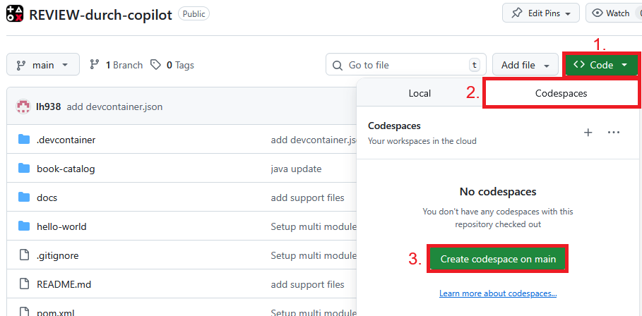

# Modul book-catalog – Workshop-Projekt

## Hintergrund
Das Projekt simuliert eine in die Jahre gekommene Backend-Anwendung zur Verwaltung eines Buchkatalogs. Sie ist absichtlich mit "Altlasten" und schlechtem Stil versehen, um als Grundlage für ein durch die KI unterstütztes Review zu dienen.

**Kontext:**
- Verwaltung von Büchern und Buchreihen
- REST-API für zentrale Buchabfrage, Filterung, Hinzufügen/Löschen
- Direkter Datenbankzugriff (H2 In-Memory, JDBC)

### Projektstruktur
- `book-catalog/src/main/java/com/example/Book.java` – Buchobjekt
- `book-catalog/src/main/java/com/example/Series.java` – Buchreihe
- `book-catalog/src/main/java/com/example/BookRepository.java` – Datenbankzugriff für Bücher
- `book-catalog/src/main/java/com/example/SeriesRepository.java` – Datenbankzugriff für Buchreihen
- `book-catalog/src/main/java/com/example/BookController.java` – REST-Endpunkte für Bücher
- `book-catalog/src/main/java/com/example/SeriesController.java` – REST-Endpunkte für Buchreihen
- `book-catalog/src/main/java/com/example/Utils.java` – Hilfsfunktionen (z.B. JSON-Serialisierung)
- `book-catalog/src/main/java/com/example/MainApp.java` – Startpunkt, Server-Setup
- `book-catalog/src/main/resources/data.sql` – Datenbankschema & erste Daten
- `book-catalog/src/test/java/com/example/` – Tests (JUnit)

---

## Ziel des Workshops
- Identifiziere "Code Smells" und Altlasten im Projekt mithilfe Github Copilot 
- Führe gezielte Verbesserungen mithilfe von GitHub Copilot durch

## Tipps und Tricks

#### Codespace öffnen
Github Codespace kann wie im Screenshot gezeigt geöffnet werden: 

#### Hinweise

- **Fange klein an:** Probiere GitHub Copilot zuerst an einzelnen Methoden oder kleinen Klassen.
- **Stelle präzise Fragen:** Je konkreter und kontextbezogener die Anfrage, desto hilfreicher die Antwort.
- **Kontext geben:** Nenne Zweck/Aufgabenbereich der Klasse/Methode
- **Verbesserungen anfordern:** Bitte um Empfehlungen oder Alternativen
- **Frage nach Listen und Begründungen:** "`Liste alle Schwächen und erkläre, warum sie ein Problem sind.`"
- **Bitte immer um Beispielcode für Verbesserungen.**
- **Nutze GitHub Copilot auch für Namensvorschläge und Dokumentation.**
- **Frage nach Risiken bei Security, Wartbarkeit und Performance.**
- **Arbeite schrittweise und schaue jeweils, wie die LLMs den Kontext verstehen und darauf aufbauen.**

#### Hilfestellung 
Experimentiere gerne frei mit Prompts, um den Code besser zu verstehen und zu verbessern. Alternativ kannst du die Vorschläge und Prompts in [Hilfestellung](docs/hilfestellung.md) nutzen

---
**Viel Erfolg beim Reviewen!**